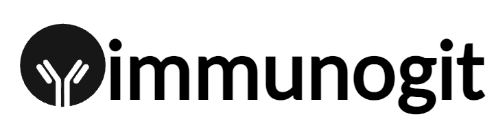

::: center
{width="30%"}
:::

 \

::: center
**Cahier des Charges**\

Encadrants\
Anna Niarakis, PU, CoSysBio, MCD-CBI\
Nicolas Ricort - Teixidor, IE, CoSysBio, MCD-CBI

------------------------------------------------------------------------

\

::: center
**ImmunoGIT**\
Création d'un référentiel de modèles et de métadonnées concernant les
réponses du système immunitaire humain\
:::

------------------------------------------------------------------------

\
:::

::: center
[Université de Toulouse]{.smallcaps}\
[M1 Bioinformatique et Biologie des Systèmes]{.smallcaps}
:::

::: center
::: flushleft
Guillaume Souède\
Issa Kerima Khalil\
Mamadou Hawa Balde\
Yasmine Boukadida
:::

::: flushright
2024 --- 2025\
:::
:::

# Contexte du projet

## Introduction biologique

Ce projet s'inscrit à l'interface de la biologie computationnelle et de
l'immunologie. Faisant le pont entre ces deux domaines, la construction
de jumeaux numériques immunitaires (IDT ou Immune Digital Twins) comme
représentations virtuelles dynamiques du système immunitaire humain
permettra de comprendre et prédire ses réponses face à des situations
variées.\
L'immunologie, science qui étudie le système immunitaire et sa
régulation, représente un véritable enjeu dans le traitement des
maladies auto-immunes (MAI) telles que la sclérose en plaques\[1\], la
polyarthrite rhumatoïde\[2\] ou le lupus érythémateux systémique\[3\],
qui affectent des millions de personnes dans le monde et entraînent des
complications sévères. Des laboratoires publics comme privés
(INSERM\[4\] et Sanofi\[5\]) évoluent dans ce domaine et proposent des
traitements complexes comme les biothérapies et les immunosuppresseurs.
Les DDDT (Digital Drug Development Twins) pourraient accélérer ce
processus de développement pharmaceutique tout en réduisant les coûts,
les DT permettant de modéliser l'impact des traitements à différents
niveaux, dont l'identification de cibles thérapeutiques et la validation
des médicaments. \[6\]\
La grande diversité des acteurs impliqués dans l'immunité et des
pathologies qui en découlent (de sévérité variable) justifient le
recours aux approches omiques, qui permettent une analyse approfondie
des mécanismes moléculaires sous-jacents. Ces approches nouvelles de la
médecine ouvrent la voie à des thérapeutiques ciblées / personnalisées.
Pourtant, la prise d'immunosuppresseurs n'est pas une pratique anodine :
par exemple, selon l'association américaine de gastroentérologie (AGA),
la réactivation de l'hépatite B constitue un risque majeur pour certains
patients\[8\]. L'AGA a mis à jour ses recommandations : la décision
entre prophylaxie antivirale ou suivi clinique dépend du niveau de
risque et du type de traitement. De plus, les aspects réglementaires et
éthiques associés à l'utilisation des DT en santé sont cruciaux : Food
and Drug Administration (FDA) et European Medicines Agency (EMA)
requièrent des normes rigoureuses pour être considérés comme des
dispositifs médicaux. Des questions éthiques, notamment relatives à la
protection des données, devront être balayées. \[6\]\
Un nombre varié d'acteurs de thématiques comme la protéomique, la
métabolomique et la transcriptomique (spatiale) s'y intègrent, comme
l'étude des régulations de l'expression génétique et la transcriptomique
spatiale, véritable cartographie de l'expression des gènes impliqués
dans un tissu, et pourraient permettre une prévention de ces MAI.\
Les modèles computationnels sont des outils essentiels pour simuler et
analyser les mécanismes complexes du système immunitaire. Ces modèles
permettent de reproduire les interactions moléculaires et cellulaires,
facilitant ainsi l'optimisation des stratégies thérapeutiques.
Cependant, leur développement est souvent freiné par l'absence de
référentiels bien structurés pour organiser et partager ces ressources.
Des bases de données comme BioModels\[9\] \[10\] hébergent des modèles
biologiques au format Systems Biology Markup Language\[11\] (SBML) conçu
pour représenter et échanger des modèles des réactions biochimiques.
Mais les modèles spécifiques au système immunitaire y restent dispersés
et insuffisamment organisés. Ce projet vise à combler cette lacune en
créant un référentiel dédié, conforme à une feuille de route issue de
l'état de l'art \[12\]. Ainsi, le référentiel sera notamment conforme
aux principes FAIR\[13\](Findable, Accessible, Interoperable, Reusable)
modulable, apte au travail en groupe et d'infrastructure robuste.\
Ce référentiel centralisera et annotera les modèles computationnels
pertinents, tout en les rendant accessibles pour des applications comme
la construction de jumeaux numériques immunitaires. En s'appuyant sur
les ressources existantes et en s'intégrant aux objectifs à court terme
d'efforts collaboratifs internationaux, ce projet contribuera à poser
les bases d'une infrastructure numérique évolutive, essentielle pour
répondre aux enjeux de la médecine de précision.\

## Équipe d'accueil

Ce projet est porté par le Professeur des Universités Anna Niarakis et
l'Ingénieur d'Études Nicolas Ricort - Teixidor, en exercice au sein du
Pôle de Biologie Computationnelle des Systèmes du Centre de Biologie
Intégrative de Toulouse (CBI).\
Le CBI est une structure de recherche multidisciplinaire internationale
axée sur la compréhension du fonctionnement des organismes vivants à
travers des approches dites intégratives et multi-échelles. Composé de
plusieurs laboratoires, dont le laboratoire hôte Biologie Moléculaire,
Cellulaire et du Développement (MCD), ses thématiques de recherche
couvrent des domaines variés répondant à des enjeux sociétaux majeurs
liés à la santé. Mais, à l'égard de ce projet plus particulièrement, il
est impliqué dans CoSysBio
(<https://cbi-toulouse.fr/eng/equipe-niarakis>) (Computational Systems
Biology for complex human diseases), qui développe des approches
intégratives combinant mathématiques, informatique et bioinformatique
pour identifier de nouvelles cibles thérapeutiques et modéliser des
pathologies complexes. Les jumeaux numériques immunologiques en sont un
enjeu majeur : des modèles hybrides associant intelligence artificielle
et réseaux mécanistiques pourraient prédire l'évolution des maladies et
affiner les stratégies thérapeutiques en médecine personnalisée \[12\].
Historiquement, un jumeau numérique est un ensemble organisé de modèles
adaptables qui émulent les comportements d'un système physique (terme
issu de l' "industrie") donné grâce à des données obtenues au long de
son cycle de vie. C'est donc un modèle dynamique, qui peut avoir
plusieurs niveaux de complexité (dits "de numérisation"). L'initiative
ImmunoGit y contribuera en structurant et partageant des modèles dédiés
à ces pathologies immunitaires.\
Plus largement, le projet bénéficiera du soutien de la Research Data
Alliance\[14\] (RDA). Cette organisation internationale créée en 2013
dédiée à la création de standards et à l'interopérabilité des données
biologiques est une passerelle entre chercheurs et cliniciens de profils
variés, axée sur la création de standards et l'interopérabilité des
données biologiques.\
Chaque groupe de travail qui la compose mène un projet collaboratif de
18 mois avec pour objectif, au travers du développement d'outils, de
bonnes pratiques et spécifications, de répondre à un besoin précis de la
communauté scientifique. Le travail réalisé s'intègre aux objectifs à
court terme, à savoir le développement d'un référentiel \[15\], du
groupe de travail Building Immune Digital Twins\[16\] (WG BIDT). Les
jumeaux numériques immunitaires (IDTs) sont une application directe de
la modélisation dans le domaine médical : ils permettent d'optimiser le
diagnostic et les traitements (dose), particulièrement pour les maladies
impliquant le système immunitaire. De par la difficulté à mesurer l'état
du système immunitaire, leur développement est complexe. Cela nécessite
des initiatives fortes, rendues possibles par le WG BIDT.\

# Description générale

## Sujet d'étude

Au cours du projet ImmunoGIT, il convient de répondre à des besoins
fondamentaux en biologie computationnelle et en immunologie au travers
d'une ressource ouverte et interopérable permettant la collecte et
l'organisation (par des étiquettes ou "tags") des modèles informatiques
pertinents pour les études sur le système immunitaire humain. Cette
ressource contribuera au développement d'outils nécessaires à la
création de jumeaux numériques immunitaires.\

## Objectifs

Le projet s'inscrit dans le domaine de la bioinformatique et des
sciences des systèmes. Il a pour ambition de développer un référentiel
FAIR modulable regroupant des modèles computationnels et leurs
métadonnées, spécifiquement orientés vers les réponses du système
immunitaire humain. Il répond ainsi à un besoin croissant en médecine de
précision et en recherche biomédicale, notamment dans le contexte des
jumeaux numériques immunitaires (Immune Digital Twins).\
Le référentiel sera constitué de modèles extraits de la section
manuellement curée de la base de données BioModels, qui est reconnue
pour sa qualité et sa pertinence scientifique. Ces modèles, décrits dans
des formats standards tels que SBML (Systems Biology Markup Language) et
SBML-QUAL (Systems Biology Markup Language - Qualitative Models)
permettent de simuler des processus biologiques complexes, comme les
interactions cellulaires, les cascades de signalisation et les
mécanismes de régulation.\
Le développement d'un tel référentiel contribuera à la recherche sur les
maladies impliquant le système immunitaire, comme les maladies
auto-immunes, les infections virales et bactériennes, ou encore les
cancers. Il servira également de base pour l'élaboration de simulations
prédictives et d'approches personnalisées dans le cadre des jumeaux
numériques immunitaires.\
L'objectif principal est de créer un référentiel en utilisant des
approches reproductibles au travers notamment de Notebooks Python
permettant :

-   De récupérer des modèles SBML et SBML-QUAL depuis la plateforme
    BioModels.

-   D'extraire et d'enrichir les métadonnées associées.

-   De centraliser les modèles et métadonnées enrichis sur un site
    GitHub.

Pour atteindre ces objectifs, plusieurs étapes clés seront mises en
place :

1.  Développement de Notebooks Python3 pour l'interaction avec BioModels
    :

    -   Utiliser des bibliothèques comme bioservices pour accéder à la
        plateforme BioModels.

    -   Automatiser la recherche, le filtrage et le téléchargement des
        modèles SBML et SBML-QUAL.

    -   Permettre l'extraction des métadonnées associées (tags,
        descriptions, ontologies).

2.  Inspection et enrichissement des modèles et métadonnées :

    -   Prévoir un processus manuel ou semi-automatique pour enrichir
        les métadonnées des modèles partiellement annotés.

    -   Ajouter des informations supplémentaires telles que des
        descriptions biologiques, des tags, et des annotations conformes
        aux standards internationaux (par exemple, Gene Ontology).

3.  Centralisation et organisation des résultats :

    -   Héberger les modèles et les métadonnées enrichis sur un dépôt
        GitHub public ou privé.

    -   Organiser les fichiers et les dossiers pour faciliter la
        navigation et la recherche.

    -   Créer une page GitHub dédiée via GitHub Pages, comprenant une
        interface utilisateur pour visualiser et télécharger les
        modèles.

4.  Documentation des outils et ressources :

    -   Documenter le fonctionnement des Notebooks Python3 et les étapes
        nécessaires pour les exécuter.

    -   Fournir un guide utilisateur pour accompagner la prise en main
        des outils et la compréhension des résultats centralisés.

5.  Validation et tests des modèles :

    -   Vérifier la conformité des modèles récupérés avec les formats
        attendus (SBML/SBML-QUAL).

# Fonctionnalités

Pour répondre aux objectifs du projet, plusieurs fonctionnalités
essentielles ont été identifiées et intégrées. Ces fonctionnalités
couvrent l'interaction avec la plateforme BioModels, le traitement des
métadonnées, la centralisation des résultats et la documentation.

## Interaction avec la plateforme BioModels

#### Description

Un script Python permettant d'interagir avec l'API de BioModels pour
rechercher et télécharger des modèles computationnels au format SBML ou
SBML-QUAL. Il filtre les modèles en fonction de mots-clés ou
d'identifiants spécifiques pour garantir leur pertinence par rapport aux
réponses immunitaires humaines.

#### Données en entrée

Mots-clés (exemple : \"immune response\", \"cytokines\", \"T-cell\").
Critères de sélection, comme les modèles \"manually curated\".

#### Données en sortie

Les fichiers de modèles générés seront au format SBML ou SBML-QUAL et
seront accompagnés, lorsqu'ils ont fait l'objet d'une curation manuelle,
d'un fichier JSON contenant les métadonnées associées. Le fichier JSON
inclura plusieurs informations essentielles, telles que le format du
modèle, son identifiant unique, son nom, ainsi que les dates de
soumission et de dernière modification. Il précisera également le(s)
nom(s) du ou des auteurs et fournira un lien vers la source du modèle.
Lorsque le fichier n'a pas fait l'objet d'une annotation manuelle, le
fichier sera au format CSV et comportera les mêmes informations.

#### Outil/Bibliothèque

BioServices\[16\], GetModelsAndMetadata.ipynb adapté de
libOmexMeta\[17\].

##### `bioservices`

Une bibliothèque Python qui permet d'interagir avec plusieurs API
bioinformatiques, comme celles de BioModels, UniProt, Ensembl, ou NCBI.
Elle simplifie l'accès aux données, permet d'automatiser le
téléchargement de modèles et l'extraction de métadonnées associées,
facilitant ainsi les tâches de récupération et de traitement des
informations biologiques.

##### `GetModelsAndMetadata.ipynb`

Un script Python qui utilise bioservices pour rechercher, télécharger et
structurer des modèles biologiques au format SBML ou SBML-QUAL à partir
de l'API BioModels.

## Organisation et structuration des métadonnées

#### Description

Structuration et organisation des métadonnées JSON récupérées avec les
modèles. Processus automatisé via des scripts Python 3.

#### Données en entrée

Métadonnées au format JSON.

#### Données en sortie

Métadonnées structurées, conservées en JSON et CSV.

## Annotation et enrichissement des métadonnées 

#### Description

Cette fonctionnalité consiste à inspecter manuellement ou
semi-automatiquement les métadonnées pour ajouter des informations
pertinentes, telles que des tags spécifiques ou des annotations
conformes aux principes FAIR. L'annotation suivra les recommandations du
standard MIRIAM\[18\] (Minimum Information Required In the Annotation of
Models) afin d'assurer l'interopérabilité et la réutilisation des
modèles.

#### Données en entrée

Métadonnées brutes au format .json récupérées avec les modèles. Fichiers
JSON des métadonnées structurées. Critères d'annotation tels que :

-   des Tags supplémentaires (par exemple : Tcell, Immuno-oncology).

-   des Balises FAIR.

#### Données en sortie

Métadonnées enrichies contenant :

-   Tags spécifiques au domaine d'étude.

-   Descriptions plus détaillées des mécanismes modélisés.

#### Outils/Bibliothèques

Interface graphique pour étiquetage, tags (par exemple : MeSH, Gene
Ontology).

## Création du référentiel GitHub

#### Description

Un dépôt GitHub intitulé \"immunogit\" est créé pour centraliser les
modèles SBML/SBML-QUAL et leurs métadonnées enrichies, tout en offrant
une interface intuitive via GitHub Pages. Le dépôt est structuré de
manière à faciliter la navigation, avec une organisation claire des
modèles et de leurs métadonnées.

#### Données en entrée

Modèles au format SBML/SBML-QUAL. Métadonnées enrichies au format JSON.

#### Données en sortie

Un référentiel GitHub[@gitHubLink] organisé contenant :

-   Un dossier principal `/models/` structuré par source des modèles :

    -   `/BioModels/` : Modèles issus de BioModels.

    -   `/Reactome/` : Modèles issus de Reactome.

    -   `/SBGN/` : Modèles au format SBGN.

-   Un dossier `/metadata/` centralisant les métadonnées, avec :

    -   `models_metadata.json` : Métadonnées globales pour tous les
        modèles.

    -   `metadata_BioModels.json` : Métadonnées spécifiques aux modèles
        BioModels.

    -   `metadata_Reactome.json` : Métadonnées spécifiques aux modèles
        Reactome.

-   Une documentation détaillée avec :

    -   Un `README.md` en anglais, qui est au moins la traduction
        complète du présent cahier des charges, et décrivant le projet
        et les instructions d'utilisation.

    -   Un wiki/guide utilisateur expliquant l'organisation et la
        contribution.

-   Une interface web via GitHub Pages permettant :

    -   La navigation et la visualisation des modèles.

    -   Le téléchargement des modèles et de leurs métadonnées associées.

#### Outils/Bibliothèques

GitHub pour la gestion du dépôt et la collaboration. GitHub Pages pour
l'interface utilisateur.

## Vérification des modèles

#### Description

Avant leur intégration dans le référentiel, les modèles téléchargés sont
vérifiés pour s'assurer qu'ils sont compatibles avec les filtres
appliqués et conformes aux formats SBML/SBML-QUAL.

#### Données en entrée

Fichiers SBML/SBML-QUAL récupérés.

#### Données en sortie

Modèles conformes aux critères définis ou signalement des éventuelles
incompatibilités.

## Documentation

# Contraintes et risques

## Contraintes fonctionnelles 

#### 1. Circuit de validation et conformité aux standards

Les modèles SBML et SBML.qual doivent respecter les standards
internationaux (ex. principes FAIR, SBML Level 3). Les métadonnées
associées doivent inclure des annotations conformes aux ontologies
reconnues (par exemple, Gene Ontology, MeSH). Les fichiers doivent
passer par une phase de validation technique (outils comme COPASI,
CellDesigner).

#### 2. Récupération et gestion des données

Les modèles doivent être extraits uniquement depuis des bases de données
validées et fiables comme BioModels. Les métadonnées doivent être
récupérées, structurées et enrichies automatiquement ou semi-
automatiquement via des scripts Python adaptés.

#### 3. Workflow spécifique

La récupération des données (modèles et métadonnées) doit suivre un
workflow défini pour garantir la cohérence :

-   Recherche via API.

-   Extraction des données pertinentes.

-   Validation et enrichissement.

-   Publication sur GitHub.

## Contraintes organisationnelles 

#### 1. Ressources humaines

Nécessité de formations ou d'une documentation approfondie afin
d'utiliser les outils (Biomodels, etc.).

#### 2. Gestion des délais

Respect des délais clés pour rendre les documents et coordination des
réunions d'avancement.

#### 3. Organisation du travail collaboratif

Chaque membre du projet doit être capable de contribuer de manière
générale aux thématiques abordées, tout en développant une
spécialisation/affinité dans un ou plusieurs des domaines suivants :

-   **Écriture et documentation** : Issa, Hawa, Yasmine et Guillaume.

-   **Initiative et coordination** : Issa, Hawa, Yasmine et Guillaume.

-   **Développement et codage** : Issa, Hawa, Yasmine et Guillaume.

-   **Suivi et mise à jour du dépôt GitHub** : Guillaume.

Il est de la responsabilité de chaque membre de veiller à une
organisation et une communication efficaces au sein du groupe de
travail. En cas d'indisponibilité prolongée d'un membre de l'équipe, une
réévaluation rapide de la répartition des tâches doit être effectuée par
les autres.

## Contraintes techniques

#### 1. Obligation d'utiliser des outils spécifiques

Utilisation de la plateforme BioModels pour récupérer les modèles et
métadonnées. Utilisation de GitHub pour centraliser et organiser les
livrables. Développement d'un script sous forme de module réutilisable
(`common_immunogit.py`) permettant son appel via l'instruction `import`
dans tous les Notebook.

#### 2. Formats et standards

Les modèles et formats sont limités :

-   Modèles uniquement au format SBML et SBML.qual.

-   Métadonnées au format JSON pour garantir leur interopérabilité.

**Organisation de l'environnement de développement** : Travail
exclusivement sur des environnements compatibles Python3. Gestion des
fichiers et scripts sur un dépôt GitHub collaboratif. Règles de codage
et conventions de nommage.
